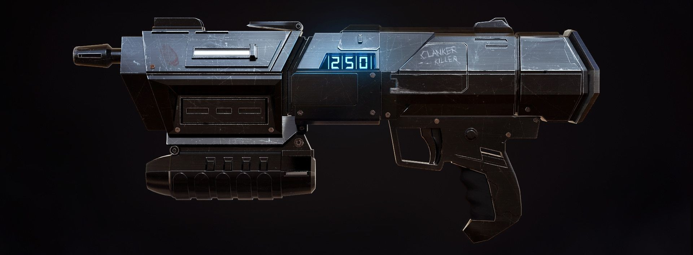

# DC-17M Interactive Prop Replica

An embedded electronics project recreating the DC-17M blaster from *Star Wars: Republic Commando* with interactive sound, lighting, and haptic feedback systems.

---

## Overview

This project combines hardware prototyping, embedded programming, and custom power management inside a constrained 3D-printed prop enclosure.

The system is built around an ESP32-S3 microcontroller and integrates:

- Real-time audio playback and sound mixing
- RGB muzzle flash effects
- Haptic feedback using DRV2605L drivers
- OLED ammo display and HUD interface
- Magazine detection and ammo management
- Rechargeable dual-18650 power system
- Custom tactical flashlight module

---

## Features

- Overlapping blaster sound playback
- Full-auto and power-shot firing modes
- Real-time haptic feedback
- Dynamic RGB muzzle flash
- OLED HUD display
- Battery-powered architecture
- Integrated tactical flashlight
- Modular and upgrade-friendly design

---

## Hardware

### Main Components

| Component | Description |
|---|---|
| ESP32-S3-WROOM-1 | Main microcontroller |
| DRV2605L | Haptic driver |
| MAX98357 | I²S audio amplifier |
| SH1106 OLED | HUD display |
| TPS61088 | Boost converter |
| 18650 Cells | Power source |

---

## Software

Developed using the Arduino framework (C++).

### Main technical topics:
- GPIO control
- I²C communication
- I²S audio streaming
- Real-time audio mixing
- Embedded UI rendering
- Power management

---

## Challenges

Some of the main engineering challenges included:

- Fitting electronics inside a limited enclosure
- Managing power delivery for motors and audio
- Preventing electrical noise and brownouts
- Synchronizing audio, lighting, and haptic effects
- Optimizing memory usage on the ESP32-S3

---

## Future Improvements

- LRA-based haptic system
- Improved flashlight optics
- Wireless diagnostics/configuration
- More advanced OLED animations
- Bluetooth integration

---

## Disclaimer

This is a personal fan-made project inspired by *Star Wars*.  
No commercial use intended.
